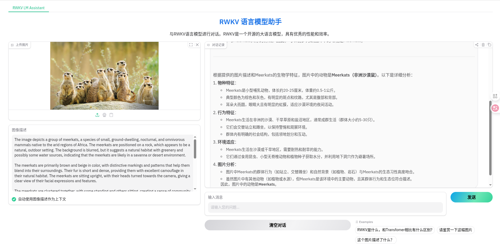
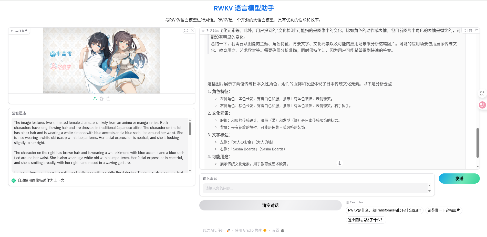
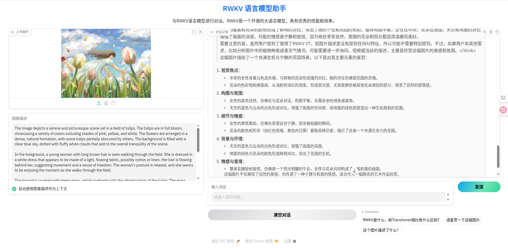

# ModRWKV_Next 🦩

使用Gradio为ModRWKV-VLM + RWKV LLM 组合创建了一个可视化界面Demo 🤗

## 预览 👀
**下面是使用了RWKV 7 G1a3 1.5B的测试结果 😎** [rwkv7-g1a3-1.5b-20251015-ctx8192.pth](https://huggingface.co/BlinkDL/rwkv7-g1/blob/main/rwkv7-g1a3-1.5b-20251015-ctx8192.pth)

<p align="center">
  
  
  
  
</p>

## 功能特性 ☝️🤓 

- 集成RWKV大语言模型支持（通过prompt注入，实现专业的语言理解）
- 通过 Mod RWKV 为 RWkV LLM 提供视觉理解支持

## 环境依赖 🫣

- CUDA 12.6+ / ROCm 6.4+
- Python 3.12
- PyTorch 2.8.0+ (Supports CUDA & ROCm)
- torchvision
- numpy
- opencv-python
- pillow
- gradio
- transformers
- ninja

**缺啥补啥哈哈 😜**

## 权重下载 🤓

**ModRWKV 权重**
```bash
wget https://huggingface.co/ZoomFly/rwkvsee0.4B/resolve/main/nonencoder.pth
```

**Siglip2 权重**
```bash
wget https://huggingface.co/google/siglip2-base-patch16-384/resolve/main/model.safetensors
```
- 你需要将这两个权重放在以下位置：😊

```
Bi-SRNet-Infer/
    └── checkpoints/
        ├── mod_rwkv/
        │    └── nonencoder.pth    # ModRWKV 权重放置位置
        └── siglip2/
            └── model.safetensors  # Siglip2 权重放置位置
```

## RWKV LLM 后端使用 🕊️

- 对于 RWKV LLM 请使用后端[**rwkv_lightning**](https://github.com/RWKV-Vibe/rwkv_lightning)

- 请使用带有CUDA graph支持的API启动推理后端来获得更好的性能

```bash
python single_infer.py --model-path <your model path> --port <your port number>
```

- 若未给出 **port number** 后端默认运行在端口8000上

- 代码默认后端在同一台机器上运行，如若要分开在多台机器上运行，请修改**app.py**中的第586行： 😢

```python
586    api_url = "http://127.0.0.1:8000/v4/chat/completions" 
```

- 请将127.0.0.1修改为实际IP
- 若后端修改了端口，请将8000修改为实际端口

## Lunching Demo 🚀

```bash
python app.py
```
- 在浏览器中打开 http://localhost:7860
- 如果在浏览器中打开失败，请检查端口是否被占用
- 如要在其他机器端访问，请将localhost修改为实际IP

## Have fun 😊